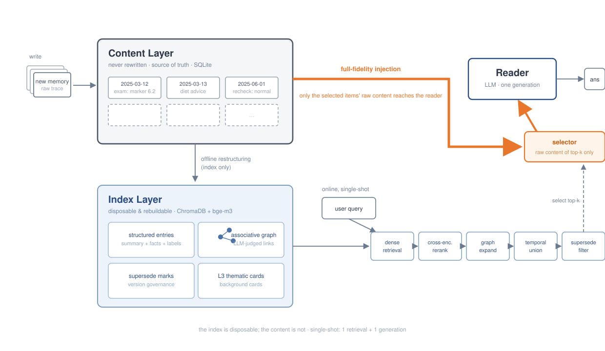

# VAULT

**VAULT: Versioned, Associative, and Unabridged Long-term Traces for Agent Memory**

Code, evaluation scripts, and result evidence for the VAULT agent-memory system (ICLR 2027 submission).

VAULT is a memory layer for LLM agents built around one thesis: **the bottleneck of agent memory is the organization of the memory layer, not the reader**. Raw dialogue turns are indexed immediately (searchable synchronously), then an offline **dream pipeline** rewrites them into structured, dated, cross-linked long-term memories — association graph, supersede versioning, absolute-date temporal anchors, and L3 topic fusion. Retrieval combines dense search, cross-encoder rerank, graph expansion, timeline union, and hierarchical channels.

<p align="center">
  
</p>

## Headline results

### LongMemEval-S (500 questions, accuracy)

| Configuration | qwen3.7-max judge | gpt-4o-mini (anscheck) | gpt-4o-mini (mempro) |
|---|---|---|---|
| NoOrg (retrieval only, no organization) | 0.716 | 0.712 | 0.758 |
| **VAULT (dream organization)** | **0.816** | **0.806** | **0.842** |

The dream/organization layer adds **≈ +10 points under both judges and both prompt conventions**. Per-question judgments for every cell: [`outputs/longmemeval/`](outputs/longmemeval/).

### LoCoMo (J score, mem0 judge prompt, n≈1540)

| Configuration | qwen3.7-max | gpt-4o-mini |
|---|---|---|
| No-dream (bge-m3, v3 prompt, top-10) | 78.77 | 82.30 |
| **VAULT (bge-m3 dream library, v3, top-10)** | **83.19** | **86.97** |
| **VAULT, top-50 (SOTA row)** | **86.11** | **89.55** |

Same-embedder dream-vs-nodream comparison: **+4.4 / +4.7 J**. Full summary: [`outputs/locomo/judge_results.json`](outputs/locomo/judge_results.json); complete archive with ablations: [`outputs/locomo/BENCHMARK_REPORT.md`](outputs/locomo/BENCHMARK_REPORT.md).

## Repository layout

```
emo/memory/            # VAULT memory OS (core library)
  dreamer.py           #   DreamOrchestrator: structuring + linking + supersede + L3 fusion
  retriever.py         #   retrieval: dense + rerank + MMR + L3 + temporal union + graph expand
  index_store.py       #   ChromaDB hot index (bge-m3 embeddings, supersede filtering)
  persistent_store.py  #   SQLite persistent layer (range queries, versioning)
  buffer.py            #   session buffer (Faiss + BM25, RRF fusion)
  temporal.py          #   rule-based temporal-expression resolver (no LLM)
  cache.py             #   L1/L2 activation cache
  assembler.py         #   prompt assembly (date prefixes, current-time anchor)
  schema.py            #   IndexEntry / MemoryFile data models
  *_loader.py          #   LoCoMo / LongMemEval / LifeBench dataset adapters
emo/scripts/           # evaluation, judging, re-answering, analysis, cost tooling
emo/aml/               # AML (Agent Memory Leaderboard) adapter — see emo/aml/README.md
figures/               # paper figures (editable SVG sources)
outputs/               # result evidence (see below)
```

**Result evidence shipped in this repo**

| Path | Contents |
|---|---|
| `outputs/longmemeval/*_judge_*detail.json` | per-question judge verdicts for every LME configuration × judge × prompt convention — every aggregate number is recomputable from these |
| `outputs/locomo/judge_results.json` | LoCoMo J-score summary across all configurations and judges |
| `outputs/locomo/BENCHMARK_REPORT.md` | full LoCoMo archive: ablation matrix (A0–A3, B1–B4), per-category breakdowns, A-MEM comparisons, noise-floor calibration |
| `outputs/cost_stats/*.json` + `outputs/cost_log*.jsonl` | raw cost-measurement logs (online tokens, dream cost) backing the paper's efficiency table |

Large per-question answer files (1–10 MB each) are not in git; they are attached to the GitHub Release.

## Quick start

```bash
# 1. environment (Python 3.10+, CUDA GPU recommended for embedding/reranker)
pip install -r requirements.txt

# 2. local models (BAAI official sources, HuggingFace or ModelScope)
#    BAAI/bge-m3            -> emo/models/bge-m3
#    BAAI/bge-reranker-v2-m3 -> emo/models/bge-reranker-v2-m3
mkdir -p emo/models
huggingface-cli download BAAI/bge-m3 --local-dir emo/models/bge-m3
huggingface-cli download BAAI/bge-reranker-v2-m3 --local-dir emo/models/bge-reranker-v2-m3

# 3. API key for the answering/dreaming LLM (Alibaba DashScope, OpenAI-compatible)
export DASHSCOPE_API_KEY=sk-...

# 4. minimal LoCoMo run (data: locomo10.json from https://github.com/snap-research/locomo,
#    expected at locomo/data/locomo10.json or passed via --data-file)
python emo/scripts/eval_locomo.py \
  --model dashscope/qwen-plus --prompt-version v3 --rerank --graph-expand \
  --embed-model emo/models/bge-m3 \
  --chroma-dir emo/memory/locomo_chroma --sqlite-dir emo/memory/locomo_sqlite \
  --out-file outputs/locomo/locomo_results.json

# 5. judge (requires the mem0 memory-benchmarks repo cloned at ./memory-benchmarks)
python emo/scripts/judge_locomo.py --files outputs/locomo/locomo_results.json
```

Full reproduction chains for every headline number (LongMemEval, LoCoMo, dream ablation, cost measurement): **[REPRODUCING.md](REPRODUCING.md)**.

## How it works (60 seconds)

```
dialogue turns ──add──▶ Buffer (RAM) ──flush──▶ SQLite (raw, DATE-anchored)
                                                   │ dream (offline)
                                                   ▼
                    ChromaDB hot index ◀── structured + linked + dated + superseded
                           │
        query ─▶ dense top-k ─▶ cross-encoder rerank ─▶ ∪ timeline range
                  ∪ graph-neighbor expansion ∪ L3 topic channel ─▶ prompt
```

- **Unabridged**: raw turns are never discarded; dreaming rewrites representations, not evidence.
- **Versioned**: contradicted facts are marked `superseded_by` (kept for provenance, excluded from retrieval).
- **Associative**: the dream-built association graph is traversed at query time (one hop) to bring corroborating evidence.

## Citation

If you use VAULT in your research, please cite (see [CITATION.cff](CITATION.cff)):

```bibtex
@inproceedings{vault2027,
  title     = {VAULT: Versioned, Associative, and Unabridged Long-term Traces for Agent Memory},
  author    = {Anonymous},
  booktitle = {Submitted to ICLR},
  year      = {2027},
  note      = {under review}
}
```

## License

[MIT](LICENSE)
